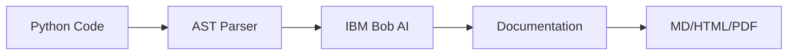

# DocGen - lablab.ai Hackathon Submission Plan

## Project Overview
**DocGen** is an AI-powered documentation generator that uses IBM Bob to automatically create rich, accurate documentation for Python codebases - from docstrings to full HTML sites.

---

## 📋 Submission Checklist

### Phase 1: Technical Setup & Testing ✅

#### 1.1 Install Dependencies
```bash
pip install click
pip install weasyprint  # Optional, for PDF export
```

#### 1.2 Test the Application
```bash
# Test on sample project
python main.py ./sample_project

# Test all formats
python main.py ./sample_project --format all --output ./demo_output

# Verify outputs in ./demo_output/
```

#### 1.3 Export IBM Bob Report
**CRITICAL REQUIREMENT**: You must export the IBM Bob report showing all AI assistance used in development.

**Steps to export IBM Bob report:**
1. Open IBM Bob VS Code extension
2. Navigate to the task/session history
3. Select all relevant tasks where Bob assisted with DocGen development
4. Click "Export Report" or use the export function
5. Save as `IBM_BOB_REPORT.md` or `IBM_BOB_REPORT.pdf`
6. Place in project root directory
7. Reference this file in your README.md

**What to include:**
- All code generation sessions
- Debugging assistance
- Architecture discussions
- Documentation improvements
- Any other Bob interactions related to this project

---

### Phase 2: Visual Assets 🎨

#### 2.1 Cover Image (16:9 aspect ratio)
**Requirements:**
- Format: PNG or JPG
- Aspect Ratio: 16:9 (e.g., 1920x1080, 1280x720)
- Content suggestions:
  - Project logo/name: "DocGen"
  - Tagline: "AI-Powered Documentation Generator"
  - Visual elements: Code snippets, documentation icons, IBM Bob logo
  - Color scheme: Professional, tech-focused

**Tools you can use:**
- Canva (free templates)
- Figma
- Adobe Express
- PowerPoint/Google Slides (export as image)

**File name:** `cover_image.png` or `cover_image.jpg`

---

### Phase 3: Presentation Materials 📊

#### 3.1 Slide Presentation (PDF)
**Structure (10-12 slides recommended):**

**Slide 1: Title**
- Project name: DocGen
- Tagline: AI-Powered Documentation Generator
- Team/Author name
- IBM Bob Hackathon 2026

**Slide 2: The Problem**
- Developers spend 20-30% of time writing documentation
- Inconsistent documentation quality across projects
- Outdated docs lead to confusion and bugs
- Manual docstring writing is tedious and error-prone

**Slide 3: Our Solution**
- Automated documentation generation using IBM Bob AI
- Extracts code structure via AST parsing
- Generates Google-style docstrings with examples
- Exports to Markdown, HTML, and PDF formats

**Slide 4: How It Works**

- Step 1: Parse Python files (AST + inspect)
- Step 2: Send metadata to IBM Bob
- Step 3: Generate rich docstrings
- Step 4: Export in multiple formats

**Slide 5: Technology Stack**
- **Language:** Python 3.8+
- **AI Engine:** IBM Bob API
- **Parsing:** ast, inspect modules
- **CLI:** Click framework
- **Export:** Markdown, HTML, WeasyPrint (PDF)
- **CI/CD:** GitHub Actions

**Slide 6: Key Features**
- ✅ Automatic docstring generation
- ✅ Multiple export formats (MD, HTML, PDF)
- ✅ Type hint extraction
- ✅ Usage examples included
- ✅ GitHub Actions integration
- ✅ CLI interface

**Slide 7: Demo Screenshots**
- CLI usage example
- Generated Markdown output
- HTML documentation site
- Before/After code comparison

**Slide 8: Market Analysis**
- **TAM (Total Addressable Market):** 27M developers worldwide
- **SAM (Serviceable Addressable Market):** 8M Python developers
- **Target Users:** Open-source maintainers, enterprise teams, solo developers

**Slide 9: Revenue Streams**
- Freemium model (basic features free)
- Pro tier: Advanced features, team collaboration
- Enterprise: Custom integrations, on-premise deployment
- API access for CI/CD pipelines

**Slide 10: Competitive Analysis**
| Feature | DocGen | Sphinx | pydoc | MkDocs |
|---------|--------|--------|-------|--------|
| AI-Generated | ✅ | ❌ | ❌ | ❌ |
| Auto Examples | ✅ | ❌ | ❌ | ❌ |
| Multi-format | ✅ | ✅ | ❌ | ✅ |
| Zero Config | ✅ | ❌ | ✅ | ❌ |

**USP:** Only tool using AI to generate complete, example-rich documentation automatically

**Slide 11: Future Roadmap**
- Multi-language support (JavaScript, TypeScript, Java)
- VS Code extension
- Real-time documentation updates
- Team collaboration features
- Integration with popular doc platforms

**Slide 12: Impact & Scalability**
- **Time Saved:** 70% reduction in documentation time
- **Quality:** Consistent, comprehensive docs
- **Adoption:** Easy integration into existing workflows
- **Scalability:** Cloud-based, handles projects of any size

**Tips:**
- Keep text minimal (2-3 sentences per slide)
- Use visuals, diagrams, and screenshots
- Professional design with consistent branding
- Export as PDF: `docgen_presentation.pdf`

---

#### 3.2 Video Presentation Script (Max 5 minutes)

**Timing Breakdown:**
- Introduction: 30 seconds
- Problem & Solution: 1 minute
- Slide Walkthrough: 2 minutes
- Live Demo: 1.5 minutes
- Closing: 30 seconds

**Script:**

**[0:00-0:30] Introduction**
"Hi, I'm [Your Name], and I'm excited to present DocGen - an AI-powered documentation generator built for the IBM Bob Hackathon 2026. DocGen solves one of the most time-consuming tasks in software development: writing comprehensive documentation."

**[0:30-1:30] Problem & Solution**
"Developers spend up to 30% of their time writing documentation, and it's often inconsistent or outdated. DocGen uses IBM Bob AI to automatically generate rich, accurate documentation for any Python codebase. Let me show you how it works through our presentation."

**[1:30-3:30] Slide Walkthrough**
- Quickly walk through slides 2-11
- Highlight key points: problem, solution, tech stack, market opportunity
- Emphasize IBM Bob integration and unique features

**[3:30-5:00] Live Demo**
"Now let me show you DocGen in action."

```bash
# Show terminal
python main.py ./sample_project --format all --output ./demo

# Show generated files
# Open HTML documentation in browser
# Highlight quality of generated docstrings
```

"As you can see, DocGen parsed our sample project, sent the code structure to IBM Bob, and generated comprehensive documentation with usage examples - all in seconds."

**[5:00] Closing**
"DocGen demonstrates the power of IBM Bob as a development partner, automating tedious tasks while maintaining high quality. Thank you for watching, and I'm excited to see how this tool can help developers worldwide."

**Recording Tips:**
- Use screen recording software (OBS Studio, Loom, or built-in tools)
- Show your face in a small corner (optional but recommended)
- Clear audio quality is essential
- Practice the demo beforehand
- Keep it under 5 minutes
- Export as MP4 format: `docgen_demo.mp4`

---

### Phase 4: Deployment 🚀

#### 4.1 GitHub Repository Setup

**Repository Structure:**
```
docgen/
├── README.md (updated with IBM Bob report reference)
├── IBM_BOB_REPORT.md (or .pdf)
├── main.py
├── requirements.txt
├── docgen/
│   ├── __init__.py
│   ├── cli.py
│   ├── parser.py
│   ├── generator.py
│   └── exporter.py
├── sample_project/
├── .github/
│   └── workflows/
│       └── docs.yml
├── output/ (example outputs)
├── LICENSE
└── .gitignore
```

**Update README.md to include:**
```markdown
## IBM Bob Integration

This project was developed with assistance from IBM Bob AI. See [IBM_BOB_REPORT.md](./IBM_BOB_REPORT.md) for details on all AI-assisted development sessions.

## Hackathon Submission

Built for IBM Bob Hackathon 2026 on lablab.ai
- [Live Demo](your-demo-url)
- [Video Presentation](your-video-url)
- [Slide Deck](link-to-slides)
```

**Make repository PUBLIC** - judges cannot review private repos!

#### 4.2 Deploy Demo Application

**Option 1: Streamlit (Recommended for Python)**
Create `streamlit_app.py`:
```python
import streamlit as st
import tempfile
import os
from docgen.cli import parse_project, generate_docs, export_html

st.title("🤖 DocGen - AI Documentation Generator")
st.write("Upload Python files to generate documentation")

uploaded_files = st.file_uploader("Choose Python files", type="py", accept_multiple_files=True)

if uploaded_files and st.button("Generate Docs"):
    with tempfile.TemporaryDirectory() as tmpdir:
        # Save uploaded files
        for file in uploaded_files:
            path = os.path.join(tmpdir, file.name)
            with open(path, "wb") as f:
                f.write(file.getbuffer())
        
        # Generate docs
        modules = parse_project(tmpdir)
        docs = generate_docs(modules, "Uploaded Project")
        html_path = export_html(docs, tmpdir, "docs")
        
        # Display
        with open(html_path) as f:
            st.components.v1.html(f.read(), height=800, scrolling=True)
```

Deploy to Streamlit Cloud (free):
1. Push code to GitHub
2. Go to share.streamlit.io
3. Connect repository
4. Deploy!

**Option 2: Replit**
1. Import GitHub repository to Replit
2. Set up `.replit` configuration
3. Make project public
4. Share the Replit URL

**Option 3: Vercel (for web interface)**
- Best if you create a web UI
- Deploy static HTML/JS frontend
- Connect to backend API

---

### Phase 5: Submission Content ✍️

#### 5.1 Short Description (Max 255 characters)
```
DocGen uses IBM Bob AI to automatically generate comprehensive Python documentation. Parse code → AI generates docstrings → Export as Markdown, HTML, or PDF. Save 70% of documentation time with consistent, example-rich docs.
```
(254 characters)

#### 5.2 Long Description (Min 100 words)

```
DocGen is an AI-powered documentation generator that revolutionizes how developers create and maintain code documentation. Built for the IBM Bob Hackathon 2026, it leverages IBM Bob's AI capabilities to automatically generate rich, accurate documentation for Python codebases.

**The Problem:**
Developers spend 20-30% of their time writing documentation, which is often inconsistent, incomplete, or quickly becomes outdated. Manual docstring creation is tedious and error-prone, leading to poor documentation quality across projects.

**Our Solution:**
DocGen automates the entire documentation process using a three-step approach:
1. **AST Parser** - Scans Python files using ast and inspect modules, extracting functions, classes, type hints, and existing docstrings
2. **IBM Bob AI** - Receives structured metadata and generates Google-style docstrings complete with usage examples
3. **Multi-format Export** - Renders documentation as Markdown, HTML, or PDF

**Key Features:**
- Zero-configuration setup - works out of the box
- Intelligent docstring generation with real usage examples
- Multiple export formats (Markdown, HTML, PDF)
- Type hint extraction and documentation
- GitHub Actions integration for automated doc updates
- CLI interface for easy integration into existing workflows

**Technology Stack:**
Built with Python 3.8+, leveraging IBM Bob API for AI generation, Click for CLI, and WeasyPrint for PDF export. The architecture is modular and extensible, making it easy to add support for additional languages and export formats.

**Impact:**
DocGen saves developers up to 70% of documentation time while ensuring consistent, comprehensive documentation quality. It's perfect for open-source maintainers, enterprise development teams, and solo developers who want professional documentation without the manual effort.

**Market Opportunity:**
With 27 million developers worldwide and 8 million Python developers specifically, DocGen addresses a universal pain point. Our freemium model offers basic features for free, with pro and enterprise tiers for advanced functionality.

**Future Vision:**
We plan to expand DocGen to support multiple programming languages (JavaScript, TypeScript, Java), create a VS Code extension, and add real-time documentation updates and team collaboration features.

DocGen demonstrates the power of IBM Bob as a true development partner, automating tedious tasks while maintaining high quality and allowing developers to focus on what they do best - writing great code.
```

#### 5.3 Technology & Category Tags

**Technology Tags:**
- IBM Bob
- Python
- AI/Machine Learning
- Natural Language Processing
- Developer Tools
- Documentation
- AST (Abstract Syntax Tree)
- CLI Tools
- GitHub Actions

**Category Tags:**
- Developer Tools
- Productivity
- AI-Powered
- Open Source
- Documentation
- Code Analysis

---

### Phase 6: Final Checklist ✅

Before submitting, verify you have:

**Required Files:**
- [ ] Cover image (16:9, PNG/JPG)
- [ ] Slide presentation (PDF)
- [ ] Video presentation (MP4, max 5 min)
- [ ] Public GitHub repository
- [ ] IBM Bob report in repository
- [ ] Working demo application URL
- [ ] Short description (≤255 chars)
- [ ] Long description (≥100 words)
- [ ] Technology tags selected
- [ ] Category tags selected

**Quality Checks:**
- [ ] Code runs without errors
- [ ] Demo application is accessible
- [ ] Video is clear and under 5 minutes
- [ ] Slides are professional and readable
- [ ] GitHub repo is PUBLIC
- [ ] IBM Bob report is included and referenced
- [ ] README.md is comprehensive
- [ ] All links work correctly

---

## 🎯 Judging Criteria Focus

Your submission will be judged on:

1. **Presentation (25%)**: Clear communication, professional materials
2. **Business Value (25%)**: Market opportunity, revenue potential, real-world impact
3. **Application of Technology (25%)**: Effective use of IBM Bob, technical implementation
4. **Originality (25%)**: Unique approach, innovative solution

**Tips to Excel:**
- Emphasize how IBM Bob is central to your solution
- Show clear before/after comparisons
- Demonstrate real time savings and value
- Highlight the unique AI-generated examples feature
- Present a clear business model and growth strategy

---

## 📞 Support & Resources

- **lablab.ai Platform**: [lablab.ai](https://lablab.ai)
- **IBM Bob Documentation**: Check IBM Bob SDK docs
- **Hackathon Guide**: Available once hackathon begins
- **Community**: Join hackathon Discord/Slack for support

---

## 🚀 Next Steps

1. Start with Phase 1 (Technical Setup)
2. Test thoroughly and export IBM Bob report
3. Create visual assets (Phase 2)
4. Develop presentation materials (Phase 3)
5. Deploy and test demo (Phase 4)
6. Write submission content (Phase 5)
7. Final review (Phase 6)
8. Submit to lablab.ai!

**Good luck with your submission! 🎉**